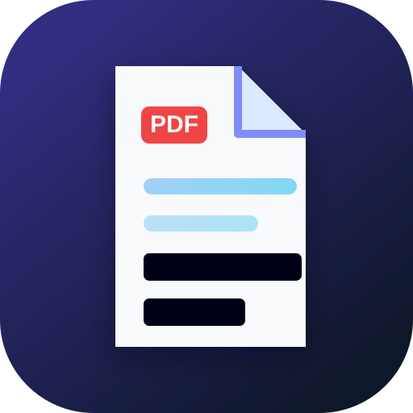

# PDF Redactor

[](https://github.com/cleanroom-ai/pdf-redaction/actions/workflows/ci.yml)
[](https://huggingface.co/spaces/cleanroom-ai/pdf-redaction)

<p align="center"></p>

**Truly redact PDFs — in your browser. Nothing uploaded.**

PDF Redactor finds secrets and personal information in PDFs, lets you review every box, and exports a new flattened PDF: every page is rasterized and black redaction boxes are burned into pixels. The result has no hidden text layer, metadata, annotations, attachments, JavaScript, or form fields.

## Why

Drawing black rectangles over a PDF often leaves the original text selectable and copyable underneath. This app demonstrates true redaction by destroying the PDF structure and keeping only page images.

## Features

- Drop, choose, paste, or open bundled fake example PDFs.
- Detects emails, phones, SSNs, cards, IBANs, bank/routing numbers, secrets, names, addresses, dates, IPs, and custom terms.
- Uses PDF.js text extraction when available; falls back to in-browser PP-OCRv6 for scanned pages.
- Optional in-browser PII name/address model.
- Page thumbnails, numbered review boxes, checkboxes, and manual drag-to-redact boxes.
- Exports with pdf-lib as flattened page images.
- Re-opens the export with PDF.js and shows `✓ Verified: 0 characters of text remain`.
- Strict CSP, no CDN, no analytics, no uploads.

## How it works

```
PDF ─► PDF.js render + text layer ─► rules + optional PII model ─┐
    └─► OCR fallback for scanned pages ───────────────────────────┤
            character spans → page pixel boxes → review → burn black boxes
            → pdf-lib image-only PDF → PDF.js verification (zero text)
```

Only black boxes are offered because blur and pixelation can sometimes be reversed for text.

## Run locally

```bash
npm ci
npm run vendor
npm test
npm run serve
```

Then open <http://127.0.0.1:7860/> (or set `PORT=8101`).

To regenerate the synthetic examples:

```bash
npm run examples
```

## CI/CD

CI installs Node 24, vendors all runtime libraries and models locally, runs Node tests, then runs a real-browser E2E test that fails on third-party requests or uploads. The deploy workflow uploads the static app to the Hugging Face Space only when `HF_TOKEN` is configured by the publisher.

## Limitations

- OCR can miss tiny, blurry, rotated, handwritten, or stylized text. Always review and draw boxes for anything missed.
- The name/address model is small and English-oriented; untick false positives.
- Flattening converts pages to images, so links and selectable text are intentionally removed.

<!-- cleanroom-ai:family:start -->
## Part of cleanroom-ai

**Clean it before you share it.** Six free privacy tools built on one shared engine. Every model runs
in your browser, so nothing you open is ever uploaded.

| | Tool | Cleans | Demo | Code |
|---|---|---|---|---|
| 🕶️ | **Screenshot Redactor** | API keys, passwords, emails, card numbers, names, faces & QR codes in screenshots | [▶ Try it](https://huggingface.co/spaces/cleanroom-ai/pii-privacy-redaction) | [GitHub](https://github.com/cleanroom-ai/screenshot-redactor) |
| 🧽 | **Log Scrubber** | tokens, cookies, passwords & PII in logs, `.env`, JSON and HAR files | [▶ Try it](https://huggingface.co/spaces/cleanroom-ai/log-secret-scrubber) | [GitHub](https://github.com/cleanroom-ai/log-secret-scrubber) |
| 📄 | **PDF Redactor** 📍 *you are here* | PII & secrets in PDFs, flattened and verified so no text survives | [▶ Try it](https://huggingface.co/spaces/cleanroom-ai/pdf-redaction) | [GitHub](https://github.com/cleanroom-ai/pdf-redaction) |
| 🔊 | **Audio Redactor** | bleeps names, phone & card numbers and secrets in recordings | [▶ Try it](https://huggingface.co/spaces/cleanroom-ai/audio-pii-redaction) | [GitHub](https://github.com/cleanroom-ai/audio-pii-redaction) |
| 📷 | **Photo Share-Safe** | GPS & hidden EXIF metadata; blurs faces and license plates | [▶ Try it](https://huggingface.co/spaces/cleanroom-ai/photo-exif-privacy) | [GitHub](https://github.com/cleanroom-ai/photo-exif-privacy) |
| 🎬 | **Video Redactor** | keys, names, emails & faces tracked through screen recordings | [▶ Try it](https://huggingface.co/spaces/cleanroom-ai/video-redaction) | [GitHub](https://github.com/cleanroom-ai/video-redaction) |
| ⚙️ | **@cleanroom-ai/core** | the shared on-device engine: OCR, secret/PII rules, NER, face detection | — | [GitHub](https://github.com/cleanroom-ai/cleanroom-core) |

All tools: [Hugging Face](https://huggingface.co/cleanroom-ai) · [GitHub](https://github.com/cleanroom-ai)
<!-- cleanroom-ai:family:end -->

## Author

Built by **Parag Sawant** ([@paragpsawant](https://github.com/paragpsawant) · [parags.dev](https://parags.dev) · [LinkedIn](https://www.linkedin.com/in/paragsawant/)).

## Credits & licenses

Apache-2.0. Uses PDF.js, pdf-lib, ONNX Runtime Web, transformers.js, PP-OCRv6, and bert-small-pii. License texts are in `licenses/` and model licenses are generated under `models/LICENSES/` by `npm run vendor`.
